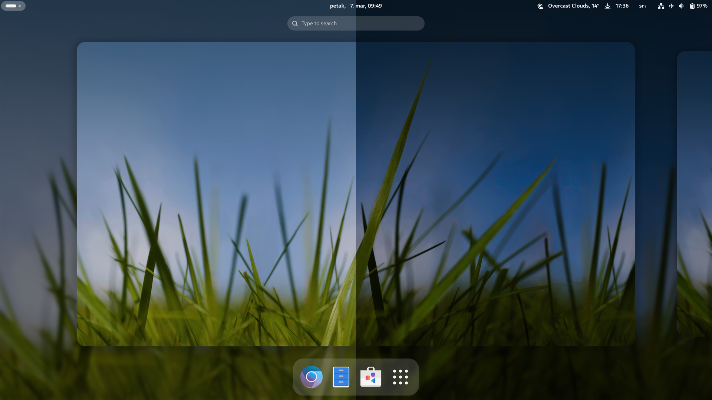

# Gidro-OS



My customized image, based on slightly customized [Silverblue-main](https://universal-blue.discourse.group/docs?topic=868) base image, which is derived from the amazing [Universal Blue](https://universal-blue.org/) project.  
Thanks to Fedora for developing the original [Fedora Silverblue](https://fedoraproject.org/atomic-desktops/silverblue/) Linux distribution.

This image is created using the easy & robust [BlueBuild](https://blue-build.org/) tooling for creating & maintaining container-based Linux desktop images.  
It is similar to making custom ROMs in the Android community, but in a much easier & more reliable way.

[**Why did I make the custom image?**](https://github.com/fiftydinar/gidro-os/wiki#my-reason-for-making-the-customized-image)

## Modifications

Removed packages (RPMs):
- [Gnome Software rpm-ostree package](https://packages.fedoraproject.org/pkgs/gnome-software/gnome-software-rpm-ostree/) (it makes Gnome Software better + more reliable to use & it's not needed since Gidro-OS uses included [ublue-os rpm-ostree auto-updater](https://github.com/ublue-os/config/blob/main/rpmspec/ublue-os-update-services.spec))
- [Gnome classic session](https://help.gnome.org/users/gnome-help/stable/gnome-classic.html.en)
- Gnome system extensions (some are from Fedora, some are from Gnome classic session, which are not needed)
- [Gnome Tweaks](https://gitlab.gnome.org/GNOME/gnome-tweaks) (It's lowly maintained & It's not officially supported by Gnome)

Replaced packages (RPMs):
- [Yafti](https://github.com/ublue-os/yafti) instead of [Gnome Initial Setup](https://gitlab.gnome.org/GNOME/gnome-initial-setup) & [Gnome Tour](https://gitlab.gnome.org/GNOME/gnome-tour)  
   (for better, more suitable first-time install experience)

Replaced packages (RPMs) with flatpaks:
- [LibreWolf](https://flathub.org/apps/io.gitlab.librewolf-community) instead of [Firefox](https://www.mozilla.org/en-US/firefox/)  
   (it has better defaults, like Ublock Origin out-of-the-box, doesn't send telemetry & it offers easy customization to fix some LibreWolf quirks)
- [Mission Center](https://flathub.org/apps/io.missioncenter.MissionCenter) instead of [Gnome System Monitor](https://gitlab.gnome.org/GNOME/gnome-system-monitor), [nvtop](https://github.com/Syllo/nvtop) & [htop](https://github.com/htop-dev/htop)  
   (it's a much better looking task manager with more useful functionality)

Installed packages (RPMs):
- [Additional Game ROM Properties for Nautilus](https://github.com/GerbilSoft/rom-properties)
- [Nautilus Python](https://github.com/GNOME/nautilus-python) (for Python Nautilus extensions)
- [Python3-icoextract](https://github.com/jlu5/icoextract) (for .exe icons thumbnailing support)
- [Gnome-randr-rust](https://github.com/maxwellainatchi/gnome-randr-rust) (xrandr equivalent for Gnome Wayland)
- [Langpacks-EN](https://packages.fedoraproject.org/pkgs/langpacks/langpacks-en/) (for avoiding Gnome Software's message about it & for potentially solving flatpak mixed locale issues)
- [Zsync](https://web.archive.org/web/20240215223506/http://zsync.moria.org.uk/index) (Needed dependency for some AppImage auto-updates)
- [Miniaturo](https://github.com/dbrgn/miniaturo) (RAW pictures thumbnailing for Nautilus)

Installed akmods:
- [NCT6687D](https://github.com/Fred78290/nct6687d) (AMD B550 chipset temperature driver)
- [OpenRazer](https://openrazer.github.io/) (for supporting Razer devices)
- [OpenRGB](https://openrgb.org/) (for supporting RGB devices)
- [XOne](https://github.com/medusalix/xone) (Xbox One RF driver)
- [XPadNeo](https://github.com/atar-axis/xpadneo) (Xbox One Bluetooth driver)
- [XPad](https://github.com/paroj/xpad) (Xbox/Xbox 360 USB & RF driver + Xbox One USB driver - built-in into upstream kernel)
- [WineSync](https://github.com/Cat-Lady/winesync-dkms/blob/main/README.md) (for possibly improving Windows apps performance)
- [Zenergy](https://github.com/BoukeHaarsma23/zenergy) (AMD Ryzen/Threadripper CPU sensor reading driver)

Installed extensions:
- [Blur My Shell](https://github.com/aunetx/blur-my-shell)
- [Caffeine](https://github.com/eonpatapon/gnome-shell-extension-caffeine)
- [Quick Close in Overview](https://github.com/p91paul/middleclickclose)
- [OpenWeather Refined](https://github.com/penguin-teal/gnome-openweather)
- [Notifications Alert](https://extensions.gnome.org/extension/258/notifications-alert-on-user-menu/)
- [Bluetooth Battery Meter](https://maniacx.github.io/Bluetooth-Battery-Meter/)
- [Night Time Switcher](https://gitlab.com/rmnvgr/nightthemeswitcher-gnome-shell-extension)
- [RebootToUEFI](https://github.com/UbayGD/reboottouefi)

Installed flatpaks:
- [Boxes](https://apps.gnome.org/en/Boxes/)
- [Calculator](https://apps.gnome.org/en/Calculator/)
- [Calendar](https://apps.gnome.org/en/Calendar/)
- [Camera](https://apps.gnome.org/en/Snapshot/)
- [Contacts](https://apps.gnome.org/en/Contacts/)
- [Clocks](https://apps.gnome.org/en/Clocks/)
- [Decoder](https://flathub.org/apps/com.belmoussaoui.Decoder)
- [Document Viewer](https://apps.gnome.org/en/Evince/)
- [Maps](https://apps.gnome.org/en/Maps/)
- [Text Editor](https://apps.gnome.org/en/TextEditor/)
- [G4Music](https://flathub.org/apps/com.github.neithern.g4music)
- [Clapper](https://flathub.org/apps/com.github.rafostar.Clapper)
- [Image Viewer](https://apps.gnome.org/en/Loupe/)
- [Secrets](https://apps.gnome.org/en/Secrets/)
- [Authenticator](https://flathub.org/apps/com.belmoussaoui.Authenticator)
- [Sticky Notes](https://flathub.org/apps/com.vixalien.sticky)
- [Rnote](https://flathub.org/apps/com.github.flxzt.rnote)
- [LocalSend](https://flathub.org/apps/org.localsend.localsend_app)
- [GPU Screen Recorder](https://flathub.org/apps/com.dec05eba.gpu_screen_recorder)
- [Flatseal](https://flathub.org/apps/com.github.tchx84.Flatseal)
- [Warehouse](https://flathub.org/apps/io.github.flattool.Warehouse)
- [PinApp](https://flathub.org/apps/io.github.fabrialberio.pinapp)
- [Extension Manager](https://flathub.org/apps/com.mattjakeman.ExtensionManager)
- [Easy Effects](https://flathub.org/apps/com.github.wwmm.easyeffects)

Optional flatpaks:
- [Warp (Global File Sharing)](https://apps.gnome.org/en/Warp/)
- [OBS Studio (Screen Recorder)](https://flathub.org/apps/com.obsproject.Studio)
- [Thunderbird (Email)](https://flathub.org/apps/org.mozilla.Thunderbird)
- [Discord](https://flathub.org/apps/com.discordapp.Discord)
- [Telegram](https://flathub.org/apps/org.telegram.desktop)
- [FreeTube (YouTube alt.)](https://flathub.org/apps/io.freetubeapp.FreeTube)
- [Dialect (Translator)](https://apps.gnome.org/en/Dialect/)
- [Deluge (Torrent)](https://flathub.org/apps/org.deluge_torrent.deluge)
- [ASCII Draw](https://flathub.org/apps/io.github.nokse22.asciidraw)
- [InkScape](https://flathub.org/apps/org.inkscape.Inkscape)
- [Mousai (Shazam alt.)](https://apps.gnome.org/en/Mousai/)
- [NewsFlash](https://apps.gnome.org/en/NewsFlash/)
- [LibreOffice](https://flathub.org/apps/org.libreoffice.LibreOffice)
- [Tagger](https://flathub.org/apps/org.nickvision.tagger)
- [Parabolic (YouTube Downloader)](https://flathub.org/apps/org.nickvision.tubeconverter)
- [Nicotine+ (Soulseek alt.)](https://flathub.org/apps/org.nicotine_plus.Nicotine)
- [Tenacity (Audacity alt.)](https://flathub.org/apps/org.tenacityaudio.Tenacity)
- [GitHub Desktop](https://flathub.org/apps/io.github.shiftey.Desktop)
- [Steam](https://flathub.org/apps/com.valvesoftware.Steam)
- [ProtonPlus (Steam Proton Manager)](https://flathub.org/apps/com.vysp3r.ProtonPlus)
- [Grapejuice (Roblox)](https://flathub.org/apps/net.brinkervii.grapejuice)
- [Space Cadet Pinball](https://flathub.org/apps/com.github.k4zmu2a.spacecadetpinball)
- [Cartridges (Universal Game Launcher)](https://apps.gnome.org/en/Cartridges/)
- [DuckStation (PS1 Emulator)](https://flathub.org/apps/org.duckstation.DuckStation)
- [PCSX2 (PS2 Emulator)](https://flathub.org/apps/net.pcsx2.PCSX2)
- [RPCS3 (PS3 Emulator)](https://flathub.org/apps/net.rpcs3.RPCS3)
- [PPSSPP (PSP Emulator)](https://flathub.org/apps/org.ppsspp.PPSSPP)
- [Xemu (OG-Xbox Emulator)](https://flathub.org/apps/app.xemu.xemu)
- [simple64 (N64 Emulator)](https://flathub.org/apps/io.github.simple64.simple64)
- [Dolphin Emulator (GameCube/Wii/TriForce Emulator)](https://flathub.org/apps/org.DolphinEmu.dolphin-emu)
- [MelonDS (DS/DSi Emulator)](https://flathub.org/apps/net.kuribo64.melonDS)
- [Ryujinx (Switch Emulator)](https://flathub.org/apps/org.ryujinx.Ryujinx)
- [DOSBox Staging (DOS Emulator)](https://flathub.org/apps/io.github.dosbox-staging)

Optional config:
- [Hide GRUB text output on boot](https://github.com/fiftydinar/gidro-os/wiki/Gidro%E2%80%90OS-Config#how-to-apply-hide-grub-text-output-on-boot-config) (if you want to make boot process faster [press Shift on boot if you need to see boot menu])
- [Hide close button from windows](https://github.com/fiftydinar/gidro-os/wiki/Gidro%E2%80%90OS-Config#how-to-apply-hide-close-button-from-windows-config) (useful for mouses which have a special key for closing applications window)
- [Scheduled nightly reboot](https://github.com/fiftydinar/gidro-os/wiki/Gidro%E2%80%90OS-Config#how-to-apply-scheduled-nightly-reboot-config) (useful for applying system updates if you're leaving your PC turned on 24/7)

Settings applied by default:
- [Enabled Vulkan support for AMD GCN 1.0 & GCN 2.0 GPUs](https://thespecter.net/blog/technology/enabling-amdgpu-on-fedora-31-for-using-vulkan-with-r7-and-r9-radeon-cards/) (for better performance & compatibility with those GPUs)
- [Enabled CUDA translation layer called ZLUDA for AMD GPUs](https://github.com/vosen/ZLUDA) (allows to run Nvidia AI applications on AMD GPUs)
- [Kyber I/O scheduler for SSDs/NVMEs, BFQ I/O scheduler for HDDs/microSDs/eMMCs](https://github.com/pop-os/default-settings/pull/149) (for improved responsiveness under I/O load)
- [ZSTD I/O scheduler for ZRAM & better ZRAM values suited for desktop](https://github.com/pop-os/default-settings/pull/163) (avoids OOM situations better & it also improves responsiveness under I/O load)
- [Set memlock limit from 64kb to 2GB](https://github.com/RPCS3/rpcs3/issues/9328#issuecomment-732712084) (maps maximum locked value of 2GB per operation, needed for RPCS3 emulator)
- [Increased vm.max_map_count value to match SteamOS](https://www.reddit.com/r/linux_gaming/comments/10x1e6u/fix_hogwarts_legacy_loading_screen_crash/) (to allow some memory-hungry applications such as games to use more memory maps, which allows them to run & not crash)
- [Disabled kernel split-lock mitigate](https://github.com/doitsujin/dxvk/issues/2938) (for restoring performance of affected games)
- [Enabled Nvidia GSP firmware for Nouveau GPU driver](https://nouveau.freedesktop.org/PowerManagement.html) (to enable power-management for Nvidia GTX 1650+ GPUs)
- [Increased inotify limits](https://www.suse.com/support/kb/doc/?id=000020048) (for preventing errors like "too many open files" when installing/using some huge applications & games)
- [Increased file nolimits](https://github.com/lutris/docs/blob/master/HowToEsync.md) (for preventing non-working Esync)
- [BBR TCP congestion algorithm & FQ network packet scheduling](https://docs.google.com/spreadsheets/d/1I1NcVVbuC7aq4nGalYxMNz9pgS9OLKcFHssIBlj9xXI/edit#gid=1142336892) (for better network performance, especially in low-signal situations)
- [Partially fixed caps-lock delay](https://forum.manjaro.org/t/caps-lock-behaviour-wayland/79868) (which is present in all other Linux distributions)
- Enabled num-lock by default
- Enabled touchpad tap-to-click
- Set font hinting to "None"
- Set Nokia Pure Text font as default
- Set a beautiful Symbian^3 picture as a wallpaper, including dark variant
- [Set light & dark theme to AdwGtk3 for GTK3 applications](https://github.com/lassekongo83/adw-gtk3) (to make Adwaita design more consistent)
- [Use MoreWaita icon pack](https://github.com/somepaulo/MoreWaita) (to extend Adwaita theme icon language)
- Set Serbian Latin language as the locale (display language remains English)
- Set top bar to show weekday too in all languages
- Show battery percentage in top bar
- Power button powers off PC instead of suspending it
- Enabled "Remove Old Trash files automatically" in Nautilus (every 30 days by default in Gnome)
- Set mouse acceleration to flat
- Disabled mouse middle-click to paste (and possibly touchpad 3-click to paste)
- Set BlurMyShell sigma value to 5, as default value is too strong & looks cheap when using default background
- Set OpenWeather Refined to:
  - show conditions in top bar
  - show sunrise/sunset in top bar
  - use "mbar" as pressure unit
  - use arrows for wind direction
  - use packaged icons
- Set Notifications Alert to use less distracting, but still noticeable color for the alert instead of default bright red. This color also fits the top bar blur much better.
- Set Bluetooth Battery Meter to show battery percentage
- Set Night Time Switcher time offset to 0 & set manual time (time based on automatic location is not accurate. Manual location can be specified instead)
- Enabled Nautilus "Sort folders before files"
- Set keyboard delay to be much lower, as Gnome defaults are too slow
- ["Window not responding" dialog extended to 20s](https://github.com/ValveSoftware/csgo-osx-linux/issues/669) (to prevent constant dialog showup in some games)
- Add Nautilus "New Document" to context menu
- Set Gnome Software to use Flathub-user remote by default (makes separation between OS flatpaks & user flatpaks much better)
- Disable Gnome Software flatpak auto-updater (not needed since Gidro-OS uses included [ublue-os flatpak auto-updater](https://github.com/ublue-os/config/blob/main/rpmspec/ublue-os-update-services.spec))
- Disable Gnome Software "Software Repositories" option (Warehouse implements the same functionality)
- [Lock some settings to prevent users messing with the system reliability, while still remaining customizable](https://github.com/fiftydinar/gidro-os/wiki/Unsupported-Operations#why-are-some-setting-toggles-grayed-out-i-cant-change-them)
- Hide ROM Properties desktop shortcut
- [Include latest auto-downloaded Proton-GE for Steam](https://github.com/GloriousEggroll/proton-ge-custom) (you still need to manually enable it, including when new version comes out)
- [Include StevenBlack hosts file for blocking ads, malware, porn & gambling](https://github.com/StevenBlack/hosts)
- Enable silent auto-start on boot for those applications:
  - Steam
  - Discord
  - Telegram
  - Deluge
  - TutaMail
- Set Text Editor to:
  - use Nokia Pure text font
  - disable Restore Session
  - use higher contrast theme
  - highlight line numbers
- Set Calculator to separate thousands
- Set Clapper (Videos) to:
  - use Nokia Pure font for subtitles
  - 100% volume by default
  - quit when video ends
- Set LibreWolf to:
  - enable WebGL
  - disable ResistFingerprinting
  - disable deleting cookies & cache on exit
  - enable auto-scroll
  - disable middle-click paste
  - disable Ctrl+Q on quit
  - enable rounded window bottom edge
  - download to Downloads folder without asking
  - enable favorite websites in homepage
  - set 2 rows for favorite websites
  - disable tab manager arrow
  - enable switching tabs with mouse-wheel
  - autohide "Downloads" button.
- G4Music background playback enabled
- Use cool BlueBuild boot & login-screen logo instead of Fedora

## Installation (ISO) [Recommended]

Please read the [Wiki](https://github.com/fiftydinar/gidro-os/wiki) before proceeding with the installation.

ISO doesn't require an active internet connection during its usage.

### [DOWNLOAD LINK](https://archive.org/download/gidro-os_17-04-2024/__w/_actions/ublue-os/isogenerator/1.0.9/end_iso/gidro-os_17-04-2024.iso)
### [TORRENT LINK](https://archive.org/download/gidro-os_17-04-2024/gidro-os_17-04-2024_archive.torrent)<br/>(higher download speed)
### [ISO CHECKSUM](https://archive.org/download/gidro-os_17-04-2024/__w/_actions/ublue-os/isogenerator/1.0.9/end_iso/gidro-os_17-04-2024-CHECKSUM)<br/>(verify the checksum if ISO is downloaded correctly with apps like [Collision](https://flathub.org/apps/dev.geopjr.Collision))

Just download the ISO & proceed with installation.

If you are on UEFI system, you will notice blue MOK screen after installer, which is used for enrolling security keys.
If your system uses Secure Boot, you will need to "Enroll key" with a password `ublue-os` (type minus on a keyboard as - sign if you get errors).

Otherwise, continue boot.

## Installation (Rebase)

Please read the [Wiki](https://github.com/fiftydinar/gidro-os/wiki) before proceeding with the installation.

Rebasing is only supported from Fedora Silverblue edition.

If your system uses Secure Boot, you will need to enroll security key before rebase with the command below (requires internet).
It will prompt you for sudo user password, so type that, then type the password for secure key, which is `ublue-os`:

```
wget -q https://github.com/ublue-os/akmods/raw/main/certs/public_key.der -O /tmp/akmods-ublue.der && sudo mokutil --timeout -1 && sudo mokutil --import /tmp/akmods-ublue.der && rm /tmp/akmods-ublue.der
```

To rebase an existing Silverblue installation to the latest build:

- Reset any package overrides that you might have:
  ```
  rpm-ostree override reset --all
  ```
- Reset any initramfs modifications that you might have:
  ```
  rpm-ostree initramfs --disable
  ```
  ```
  rpm-ostree initramfs-etc --untrack-all
  ```
- Rebase to the unsigned image, to get the proper signing keys and policies installed:
  ```
  rpm-ostree rebase ostree-unverified-registry:ghcr.io/fiftydinar/gidro-os:latest
  ```
- Reboot to complete the rebase:
  ```
  systemctl reboot
  ```

- If you followed Secure Boot instructions, you will be prompted with blue MOK screen, which is used for enrolling security keys.
  Choose "Enroll key" & type `ublue-os` as a password (type minus on a keyboard as - sign if you get errors). Continue boot afterwards.

- Then rebase to the signed image, like so:
  ```
  rpm-ostree rebase ostree-image-signed:docker://ghcr.io/fiftydinar/gidro-os:latest
  ```
- Reboot again to complete the installation
  ```
  systemctl reboot
  ```

## COPR repos used for some installed RPM packages
- [ROM Properties](https://copr.fedorainfracloud.org/coprs/kylegospo/rom-properties/)
- [Gnome-randr-rust](https://copr.fedorainfracloud.org/coprs/fiftydinar/gnome-randr-rust/)
- [OpenWeather Refined](https://copr.fedorainfracloud.org/coprs/fiftydinar/gnome-shell-extension-openweatherrefined/)
- [Zsync](https://copr.fedorainfracloud.org/coprs/elxreno/zsync/)
- [Miniaturo](https://copr.fedorainfracloud.org/coprs/decathorpe/miniaturo/)

## Plans for the future
- Integrate all post-setup into image as much as possible
- Find solution for lack of popular used fonts, mostly from Microsoft & Apple (BetterFonts causes font hinting issues, so other solution is needed)
- Use upstream isogenerator action instead of my own
